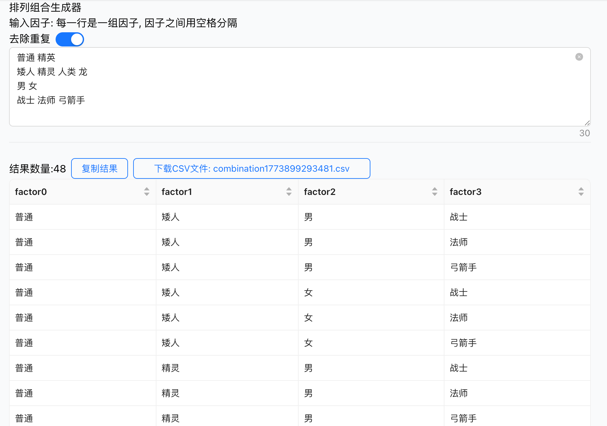
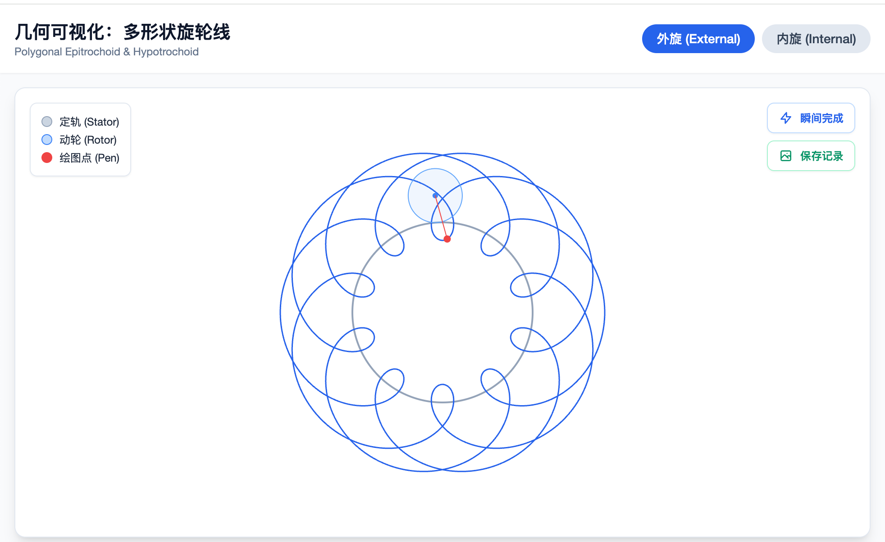
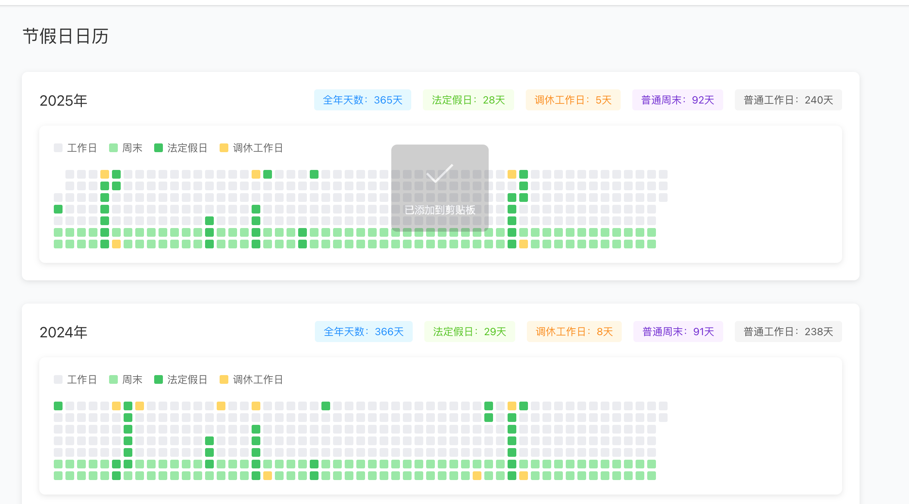
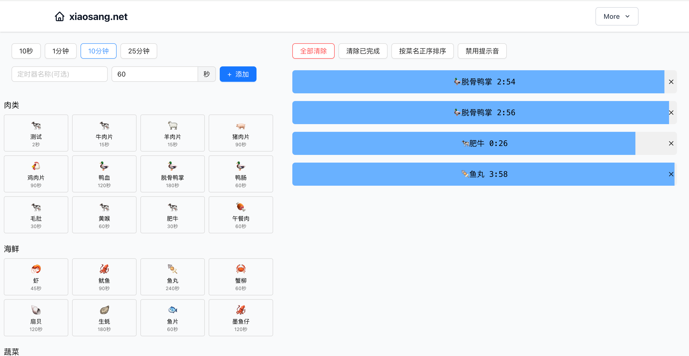

# 概况

# 作品列表/demo地址
## 翻阅经典, 与一个惊艳的名字不期而遇: 古诗文起名 
demo: https://holynova.github.io/gushi_namer/

## Gemini 批量生图插件 / Gemini Batch Image Generator
- link: https://github.com/holynova/prompt_one_by_one
- 

## Scrape to Markdown
一个多功能 Chrome 扩展，用于内容抓取、格式转换和批量图片下载。
https://github.com/holynova/scrape-to-markdown.chrome

## 坦克战术 (Tank Tactics Game)
link: https://github.com/holynova/tank-tactics-game
demo: 
一个基于 React + Vite 的回合制战术对战游戏，支持双人对战(PvP)和人机对战(PvE)。

## 俳句tinder
- link: https://github.com/holynova/haiku-flow
- demo: https://holynova.github.io/haiku-flow
- Haiku Flow 是一个极简主义的 Web 应用程序，旨在帮助您发现和欣赏俳句之美。通过类似 Tinder 的滑动界面，您可以轻松浏览精选的经典俳句，收藏您喜爱的作品，并追踪您的每日阅读习惯。
- 
- 

# youtube视频抓取

- 

## 收藏夹淘金
- 这是一个很简单的 Chrome 插件。 它会在你打开新标签页时，从你的收藏夹里随机挑 3 条出来给你看。 点开算一次访问，你每次看到它也会记录一次展示。

- 你可以点“再翻三张”，继续随机看。 书签有新增或删除，它会自己更新。

- link: https://github.com/holynova/collection_miner

## 强迫症福利:等宽文字生成器 
demo: https://holynova.github.io/equal_width/

## 刘庸干净又卫生: 弹幕附魔 
demo: https://holynova.github.io/string_alchemy/

## 排序算法可视化 
demo: https://holynova.github.io/algorithm/show_sort/index.html

## 藏头诗生成器 
demo: https://holynova.github.io/head_tail_poem/

## 倒推工资
demo: https://holynova.github.io/salary

## 排列组合生成器 
demo: https://holynova.github.io/combination

## 电子万花尺
demo: https://github.com/holynova/spinning-drawer/
link: https://holynova.github.io/spinning-drawer/

## One Second Movie / 一眼看电影
- demo: https://github.com/holynova/one_second_movie/
- link: https://holynova.github.io/one_second_movie/
- 

# Life Bar Chart 生命时间轴可视化
https://github.com/holynova/life_bar_chart

## 节假日可视化

## 火锅定时器

## 100-clocks
- link: https://github.com/holynova/100-clocks
- demo: https://holynova.github.io/100-clocks

## TS神器: JSON转TypeScript定义 
demo: https://holynova.github.io/json_to_ts/

# 语言统计

