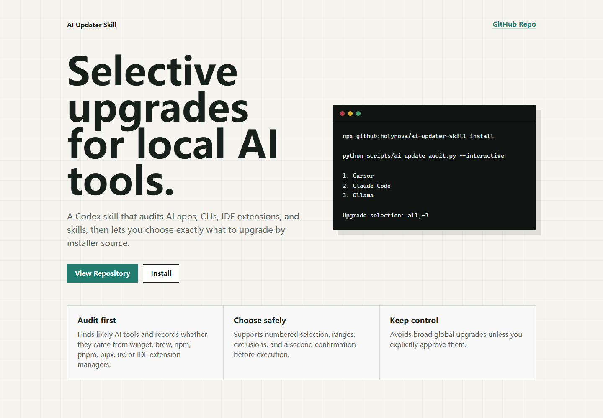
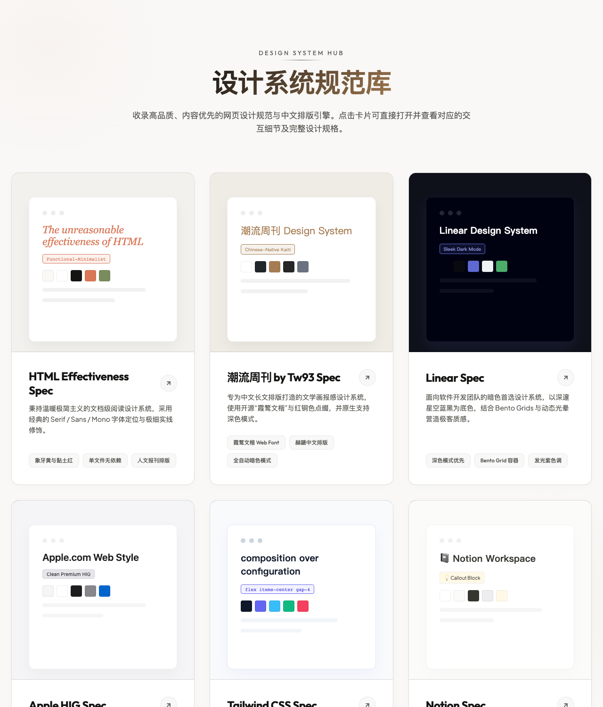
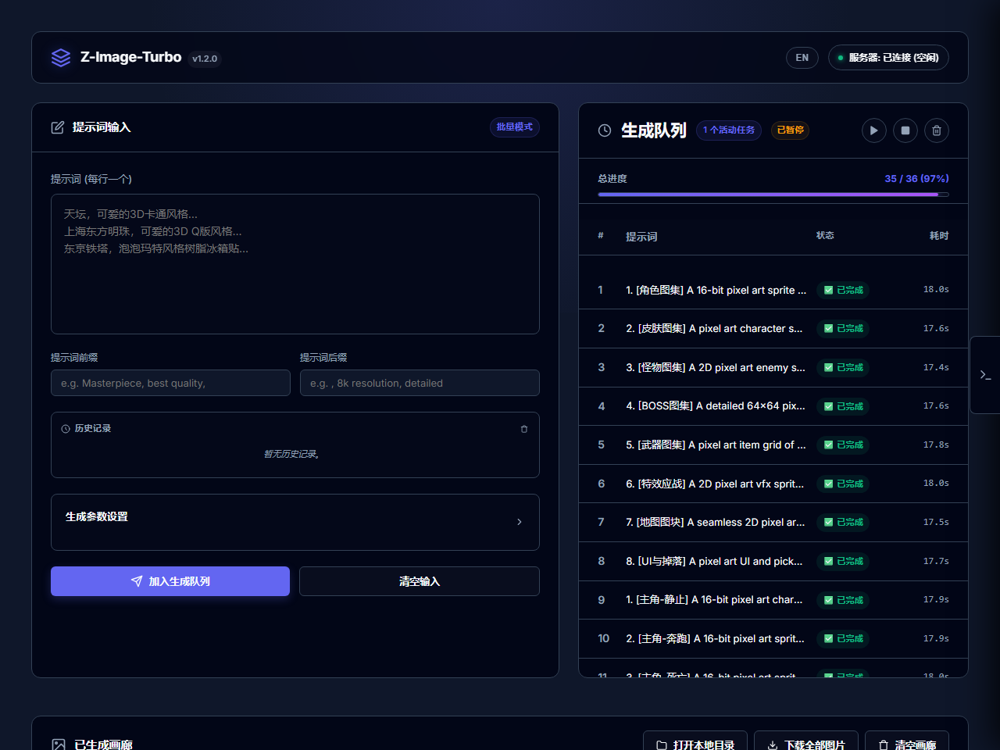
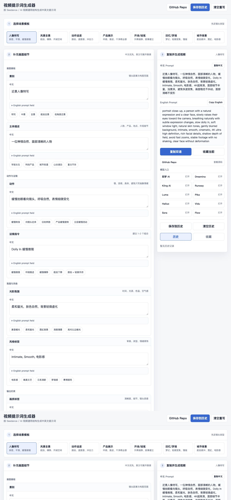

# 概况

## 项目列表

按最近更新时间排序，gushi_namer 固定第一。

| ⭐ | 项目 | 预览 | 简介 | 链接 |
|---:|---|---|---|---|
| 2225 | 古诗文起名 |  | 诗经楚辞唐诗宋词起名 | [Demo](https://holynova.github.io/gushi_namer/) · [Repo](https://github.com/holynova/gushi_namer) |
| 0 | GitHub Pages Detector |  | GitHub repo Pages 状态检测插件 | [Demo](https://holynova.github.io/github-pages-detector-extension/) · [Repo](https://github.com/holynova/github-pages-detector-extension) |
| 0 | 收藏夹淘金 |  | 新标签页随机展示收藏夹 | [Repo](https://github.com/holynova/collection_miner) |
| 0 | 韵脚画布 |  | 移动端中文押韵字查找 | [Demo](https://holynova.github.io/char_finder/) · [Repo](https://github.com/holynova/char_finder) |
| 0 | 网页动效设计灵感库 |  | 30 个经典网页动画 + AI 提示词 | [Demo](https://holynova.github.io/web-motion-showcase/) · [Repo](https://github.com/holynova/web-motion-showcase) |
| 0 | AI Updater Skill |  | 审计 AI apps 并安全升级 | [Demo](https://holynova.github.io/ai-updater-skill/) · [Repo](https://github.com/holynova/ai-updater-skill) |
| 0 | 设计系统目录库 |  | 网页设计规范 + 低饱和配色 | [Demo](https://holynova.github.io/my-design-system/) · [Repo](https://github.com/holynova/my-design-system) |
| 1 | 电子万花尺 |  | 旋轮线可视化，多形状配色 | [Demo](https://holynova.github.io/spinning-drawer/) · [Repo](https://github.com/holynova/spinning-drawer) |
| 0 | 人像时间线 |  | 人脸照片对齐 + MP4/GIF 导出 | [Demo](https://holynova.github.io/photo_align/) · [Repo](https://github.com/holynova/photo_align) |
| 0 | Z-Image-Turbo Local Studio |  | 本地 AI 生图工作台 | [Demo](https://holynova.github.io/image_local_llm/) · [Repo](https://github.com/holynova/image_local_llm) |
| 0 | 书香管家 |  | AI 拍照识别 + 3D 虚拟书架 | [Demo](https://holynova.github.io/bookshelf_manager/) · [Repo](https://github.com/holynova/bookshelf_manager) |
| 0 | 视频提示词生成器 |  | 中英文 AI 视频 Prompt 模板 | [Demo](https://holynova.github.io/video_prompt_generator/) · [Repo](https://github.com/holynova/video_prompt_generator) |
| 0 | Offer 比较神器 |  | 薪资对比 + 多维评分图表 | [Demo](https://holynova.github.io/offer_compare/) · [Repo](https://github.com/holynova/offer_compare) |
| 0 | Scrape to Markdown |  | 网页转 Markdown + 图片批量打包 | [Repo](https://github.com/holynova/scrape-to-markdown.chrome) |
| 0 | iOS打字模拟 |  | iOS 键盘自适应消隐模拟 | [Demo](https://holynova.github.io/keyboard_sentence/) · [Repo](https://github.com/holynova/keyboard_sentence) |
| 6 | Gemini 批量生图插件 |  | 提示词逐条发送 + 进度条 | [Repo](https://github.com/holynova/prompt_one_by_one) |
| 0 | 坦克战术 |  | 坦克二打一，支持 PvP/PvE | [Demo](https://holynova.github.io/tank-tactics-game/) · [Repo](https://github.com/holynova/tank-tactics-game) |
| 0 | 俳句Tinder |  | 滑动浏览经典俳句 | [Demo](https://holynova.github.io/haiku-flow) · [Repo](https://github.com/holynova/haiku-flow) |
| 0 | 一眼看电影 |  | 视频压缩为 4K 联系表 | [Demo](https://holynova.github.io/one_second_movie/) · [Repo](https://github.com/holynova/one_second_movie) |
| 1 | JSON转TypeScript定义 |  | JS 自动推导 TS 类型 | [Demo](https://holynova.github.io/json_to_ts/) · [Repo](https://github.com/holynova/json_to_ts) |
| 0 | 生命时间轴可视化 | - | 甘特图展示生命时间线 | [Repo](https://github.com/holynova/life_bar_chart) |
| 1 | 等宽文字生成器 |  | 自动调整字号使视觉等宽 | [Demo](https://holynova.github.io/equal_width/) · [Repo](https://github.com/holynova/equal_width) |
| 0 | 弹幕附魔 |  | 文字转同音化学元素 | [Demo](https://holynova.github.io/string_alchemy/) · [Repo](https://github.com/holynova/string_alchemy) |
| 4 | 藏头诗生成器 |  | 藏头诗藏尾诗生成 | [Demo](https://holynova.github.io/head_tail_poem/) · [Repo](https://github.com/holynova/head_tail_poem) |
| 0 | 排序算法可视化 |  | 排序算法可视化 playground | [Demo](https://holynova.github.io/algorithm/show_sort/index.html) · [Repo](https://github.com/holynova/algorithm) |
| 1 | 倒推工资 |  | 税后工资计算器 | [Demo](https://holynova.github.io/salary) · [Repo](https://github.com/holynova/json_to_ts) |
| 1 | 排列组合生成器 |  | 排列组合计算 + 可视化 | [Demo](https://holynova.github.io/combination) · [Repo](https://github.com/holynova/json_to_ts) |
| 1 | 节假日可视化 |  | 年度节假日日历 + 贡献图 | [Repo](https://github.com/holynova/json_to_ts) |
| 1 | 火锅定时器 |  | 多食材同时计时 | [Repo](https://github.com/holynova/json_to_ts) |
| 0 | YouTube视频抓取 |  | YouTube 视频内容抓取 | - |
| 0 | 100 Clocks |  | 不同风格的时钟集合 | [Demo](https://holynova.github.io/100-clocks) · [Repo](https://github.com/holynova/100-clocks) |

# 语言统计

