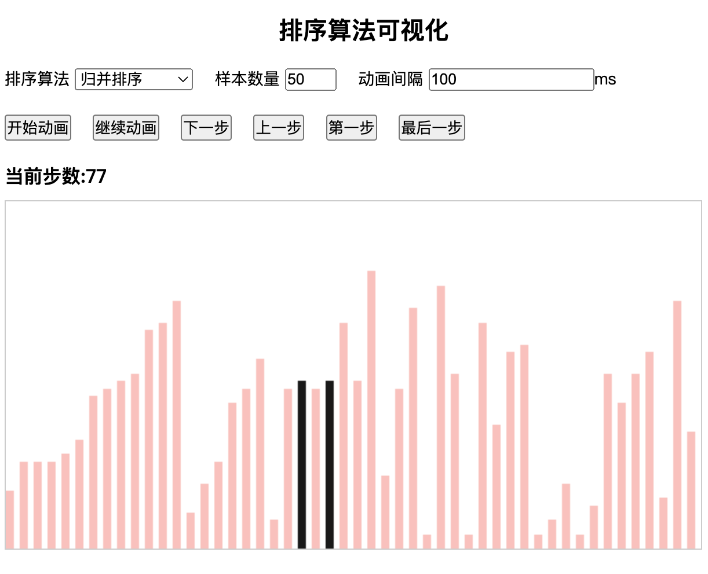
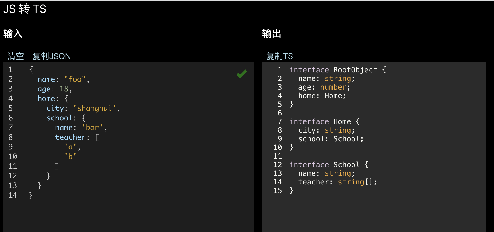

# 概况

## 🏗️ 项目列表

### 📖 快速导航
1. [韵脚画布](#韵脚画布)
1. [人像时间线](#人像时间线)
2. [视频提示词生成器](#视频提示词生成器)
3. [Offer 比较神器](#offer-比较神器)
4. [古诗文起名](#古诗文起名)
5. [Gemini 批量生图插件](#gemini-批量生图插件)
6. [Scrape to Markdown](#scrape-to-markdown)
7. [坦克战术](#坦克战术)
8. [俳句Tinder](#俳句tinder)
9. [YouTube视频抓取](#youtube视频抓取)
10. [收藏夹淘金](#收藏夹淘金)
11. [等宽文字生成器](#等宽文字生成器)
12. [弹幕附魔](#弹幕附魔)
13. [排序算法可视化](#排序算法可视化)
14. [藏头诗生成器](#藏头诗生成器)
15. [倒推工资](#倒推工资)
16. [排列组合生成器](#排列组合生成器)
17. [电子万花尺](#电子万花尺)
18. [一眼看电影](#一眼看电影)
19. [生命时间轴可视化](#生命时间轴可视化)
20. [节假日可视化](#节假日可视化)
21. [火锅定时器](#火锅定时器)
22. [100 Clocks](#100-clocks)
23. [JSON转TypeScript定义](#json转typescript定义)
24. [iOS打字模拟](#ios打字模拟)

---

### Z-Image-Turbo Local Studio

- **简介**: 本地 AI 生图工作台，支持 Z-Image-Turbo 常驻加载、批量提示词队列、暂停/继续/停止、历史记录和生成图片画廊。
- **链接**: [在线预览](https://holynova.github.io/image_local_llm/) | [源码仓库](https://github.com/holynova/image_local_llm)
- **标签**: `website` `python` `fastapi` `javascript` `ai` `tool`

---

### 韵脚画布

- **简介**: 移动端中文押韵字查找工具，取末字分析多音、声母、韵部和声调，过滤生僻字并提供随机灵感。
- **链接**: [🌐 在线预览](https://holynova.github.io/char_finder/) | [💻 源码仓库](https://github.com/holynova/char_finder)
- **标签**: `website` `mobileWeb` `typescript` `react` `chinese` `tool`

---

### 人像时间线

- **简介**: 纯前端人脸照片对齐工具，支持 Demo、日期排序、双眼对齐和 MP4/GIF 导出。
- **链接**: [🌐 在线预览](https://holynova.github.io/photo_align/) | [💻 源码仓库](https://github.com/holynova/photo_align)
- **标签**: `website` `typescript` `react` `ai` `tool` `video`

---

### 视频提示词生成器

- **简介**: 本地网页工具，用模板生成中英文 AI 视频 Prompt，支持复制、历史、收藏和常用视频模型入口。
- **链接**: [🌐 在线预览](https://holynova.github.io/video_prompt_generator/) | [💻 源码仓库](https://github.com/holynova/video_prompt_generator)
- **标签**: `website` `html` `javascript` `ai` `tool` `video`

---

### Offer 比较神器

- **简介**: Offer 比较器和总包计算器，支持奖金、股权、期权、工时、税后估算、多维评分和图表对比。
- **链接**: [🌐 在线预览](https://holynova.github.io/offer_compare/) | [💻 源码仓库](https://github.com/holynova/offer_compare)
- **标签**: `website` `html` `javascript` `tool` `calculator`

---

### 古诗文起名

- **简介**: 翻阅经典, 与一个惊艳的名字不期而遇
利用诗经、楚辞、唐诗、宋词等给小朋友起名字
支持手机查看
- **链接**: [🌐 在线预览](https://holynova.github.io/gushi_namer/) | [💻 源码仓库](https://github.com/holynova/gushi_namer)
- **标签**: `website` `mobileWeb` `typescript` `chinese` `tool`

---

### Gemini 批量生图插件

- **简介**: Gemini Batch Image Generator
一行一个提示词，自动逐条发送，支持前缀/后缀、停止队列、实时计时、滚动日志、进度条
- **链接**: [💻 源码仓库](https://github.com/holynova/prompt_one_by_one)
- **标签**: `chromeExtension` `javascript` `ai` `tool`

---

### Scrape to Markdown

- **简介**: Chrome 侧边栏效率工具，支持网页转 Markdown、微博/豆瓣数据导出、普通网页图片下载，以及 Gemini / ChatGPT 原图批量打包下载
带构建时间、自动标签选择、下载进度日志和图片数量限制
- **链接**: [💻 源码仓库](https://github.com/holynova/scrape-to-markdown.chrome)
- **标签**: `chromeExtension` `typescript` `react` `ai` `scraper` `tool`

---

### 坦克战术

- **简介**: Tank Tactics Game
童年游戏"四顶", 坦克二打一
基于 React + Vite 的回合制战术对战游戏，支持双人对战(PvP)和人机对战(PvE)
- **链接**: [🌐 在线预览](https://holynova.github.io/tank-tactics-game/) | [💻 源码仓库](https://github.com/holynova/tank-tactics-game)
- **标签**: `website` `typescript` `react` `game`

---

### 俳句Tinder

- **简介**: Haiku Flow - 极简主义的 Web 应用程序
通过类似 Tinder 的滑动界面浏览精选经典俳句
收藏喜爱的作品，追踪每日阅读习惯
- **链接**: [🌐 在线预览](https://holynova.github.io/haiku-flow) | [💻 源码仓库](https://github.com/holynova/haiku-flow)
- **标签**: `website` `mobileWeb` `typescript` `chinese`

---

### YouTube视频抓取

- **简介**: YouTube视频内容抓取工具
- **链接**: (暂无链接)
- **标签**: `tool` `scraper`

---

### 收藏夹淘金

- **简介**: Collection Miner
打开新标签页时从收藏夹随机挑3条展示
支持点赞、删除书签(可撤销)、赞/踩影响随机权重
- **链接**: [💻 源码仓库](https://github.com/holynova/collection_miner)
- **标签**: `chromeExtension` `javascript` `tool`

---

### 等宽文字生成器

- **简介**: 强迫症福利
每行输入长短不一的文字，自动调整字号，使得看起来宽度相等
- **链接**: [🌐 在线预览](https://holynova.github.io/equal_width/) | [💻 源码仓库](https://github.com/holynova/equal_width)
- **标签**: `website` `javascript` `tool`

---

### 弹幕附魔

- **简介**: 刘庸干净又卫生
将普通文字转换为同音的化学元素文字
- **链接**: [🌐 在线预览](https://holynova.github.io/string_alchemy/) | [💻 源码仓库](https://github.com/holynova/string_alchemy)
- **标签**: `website` `javascript` `fun` `tool`

---

### 排序算法可视化

- **简介**: 学习算法的 playground
排序算法的可视化展示
- **链接**: [🌐 在线预览](https://holynova.github.io/algorithm/show_sort/index.html) | [💻 源码仓库](https://github.com/holynova/algorithm)
- **标签**: `website` `javascript` `visualization` `algorithm`

---

### 藏头诗生成器

- **简介**: 藏头诗、藏尾诗生成器
- **链接**: [🌐 在线预览](https://holynova.github.io/head_tail_poem/) | [💻 源码仓库](https://github.com/holynova/head_tail_poem)
- **标签**: `website` `typescript` `chinese` `fun`

---

### 倒推工资

- **简介**: 税后工资计算器
支持两种公积金方案，工资构成分析和工资对照表
- **链接**: [🌐 在线预览](https://holynova.github.io/salary) | [💻 源码仓库](https://github.com/holynova/json_to_ts)
- **标签**: `website` `typescript` `react` `tool`

---

### 排列组合生成器

- **简介**: 支持多种元素的排列组合计算
可视化展示组合结果
- **链接**: [🌐 在线预览](https://holynova.github.io/combination) | [💻 源码仓库](https://github.com/holynova/json_to_ts)
- **标签**: `website` `typescript` `react` `tool` `algorithm`

---

### 电子万花尺

- **简介**: 多形状旋轮线可视化 / Polygonal Spirograph Visualizer
支持多种形状（圆形、椭圆、多边形）的旋轮线绘制
7种颜色方案，外旋/内旋模式，历史记录
- **链接**: [🌐 在线预览](https://holynova.github.io/spinning-drawer/) | [💻 源码仓库](https://github.com/holynova/spinning-drawer)
- **标签**: `website` `html` `visualization` `fun` `canvas`

---

### 一眼看电影

- **简介**: One Second Movie
将视频压缩为4K联系表，一眼看完整部电影
支持文件上传和URL处理，三种质量预设
- **链接**: [🌐 在线预览](https://holynova.github.io/one_second_movie/) | [💻 源码仓库](https://github.com/holynova/one_second_movie)
- **标签**: `website` `typescript` `react` `node` `tool` `video`

---

### 生命时间轴可视化
> [!NOTE]
> 该项目目前暂无预览图。

- **简介**: Life Bar Chart
根据出生和死亡年月生成甘特图
基于Canvas的高性能绘图，支持自定义时间区间，响应式设计
- **链接**: [💻 源码仓库](https://github.com/holynova/life_bar_chart)
- **标签**: `website` `typescript` `react` `visualization` `canvas`

---

### 节假日可视化

- **简介**: 年度节假日日历展示
法定假日、调休工作日统计
贡献图形式展示全年日期分布
- **链接**: [💻 源码仓库](https://github.com/holynova/json_to_ts)
- **标签**: `website` `typescript` `react` `visualization`

---

### 火锅定时器

- **简介**: 火锅食材烹饪时间管理
多食材同时计时功能
- **链接**: [💻 源码仓库](https://github.com/holynova/json_to_ts)
- **标签**: `website` `typescript` `react` `tool` `fun`

---

### 100 Clocks

- **简介**: a collection of clocks in different styles
不同风格的时钟集合
- **链接**: [🌐 在线预览](https://holynova.github.io/100-clocks) | [💻 源码仓库](https://github.com/holynova/100-clocks)
- **标签**: `website` `html` `visualization` `fun` `canvas`

---

### JSON转TypeScript定义

- **简介**: TS神器
支持 JavaScript 代码转换为 TypeScript，自动类型推导 and 类型声明生成
同时包含JSON格式化工具
- **链接**: [🌐 在线预览](https://holynova.github.io/json_to_ts/) | [💻 源码仓库](https://github.com/holynova/json_to_ts)
- **标签**: `website` `typescript` `react` `tool` `devTool`

---

### iOS打字模拟

- **简介**: iOS 软键盘自适应收缩与打字演示
模拟 iOS 键盘在输入不同句子时消隐未使用键的自适应变化。支持保留三行、单行合并、方形流式布局三种收缩模式。利用 Web Audio API 动态合成按键音，支持一键录制导出 MP4/WebM 视频。
- **链接**: [🌐 在线预览](https://holynova.github.io/keyboard_sentence/) | [💻 源码仓库](https://github.com/holynova/keyboard_sentence)
- **标签**: `website` `javascript` `animation` `audio` `video`

---

### 书香管家

- **简介**: AI 拍照智能书架整理应用
基于 React + TypeScript + IndexedDB + Gemini 2.5 Flash 多模态识别。支持拍照自动提取书籍信息、主色调及物理摆放顺序，直观还原 3D 虚拟原木书架，支持豆瓣、微信读书、淘宝链接快捷跳转。
- **链接**: [🌐 在线预览](https://holynova.github.io/bookshelf_manager/) | [💻 源码仓库](https://github.com/holynova/bookshelf_manager)
- **标签**: `website` `typescript` `react` `ai` `tool` `database`

# 语言统计

