# 概况

## 项目列表

按最近更新时间排序，gushi_namer 固定第一。

| ⭐ | 项目 | 预览 | 简介 | 链接 |
|---:|---|---|---|---|
| 2225 | 古诗文起名 | 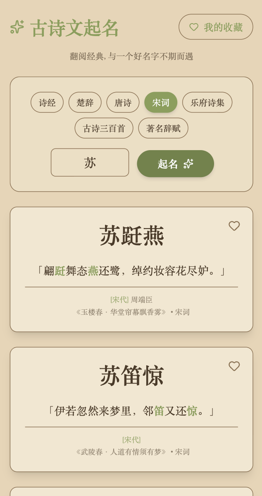 | 诗经楚辞唐诗宋词起名 | [Demo](https://holynova.github.io/gushi_namer/) · [Repo](https://github.com/holynova/gushi_namer) |
| 0 | 镜花万象 |  | 可拖动三角取样，实时生成多种平铺万花筒图案 | [Demo](https://holynova.github.io/kaleidoscope-studio/) · [Repo](https://github.com/holynova/kaleidoscope-studio) |
| 0 | 苔卡 Moss Card |  | 移动端 FSRS 闪卡 PWA，支持牌组、CSV 导入、离线学习与 Supabase 云同步 | [Demo](https://holynova.github.io/flash-card/) · [Repo](https://github.com/holynova/flash-card) |
| 0 | Win98 屏幕保护程序 | 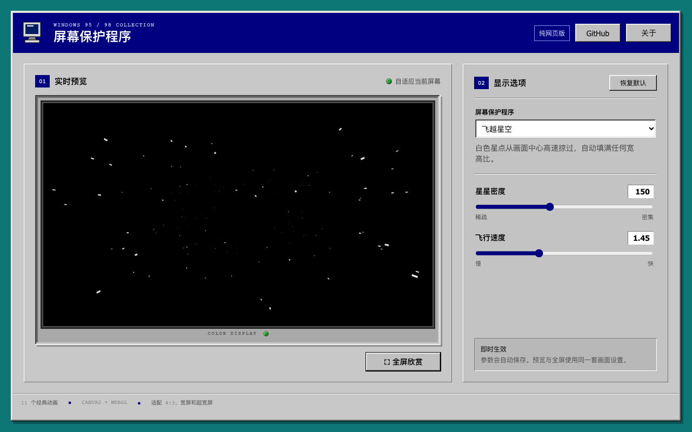 | 复刻星空、3D 管道、迷宫等经典屏保，支持调参、宽屏和全屏 | [Demo](https://holynova.github.io/win98-screen-saver/) · [Repo](https://github.com/holynova/win98-screen-saver) |
| 0 | 钟姐菜谱 | 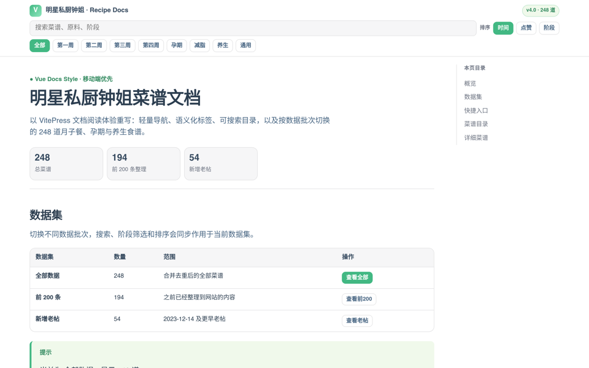 | 中式家常菜的个人静态菜谱库 | [Demo](https://holynova.github.io/zhongjie-recipes/) · [Repo](https://github.com/holynova/zhongjie-recipes) |
| 0 | AI Gallery | 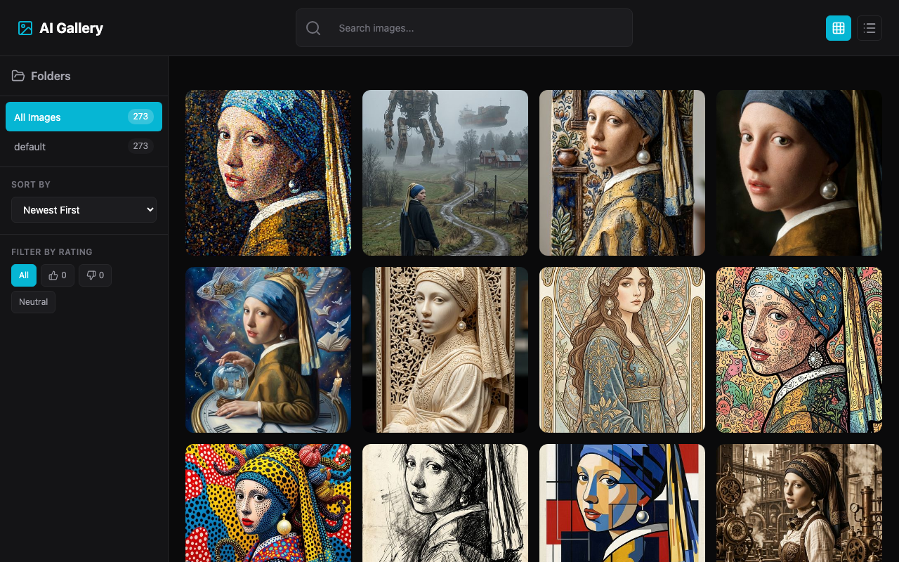 | AI 图片库，支持搜索、网格/列表视图、灯箱和深色主题 | [Demo](https://holynova.github.io/ai-gallery/) · [Repo](https://github.com/holynova/ai-gallery) |
| 0 | 课本插图写实化 |  | 将经典课本插图转成写实照片的对照图库 | [Demo](https://holynova.github.io/text_book_pics/) · [Repo](https://github.com/holynova/text_book_pics) |
| 0 | 24 点全解 | 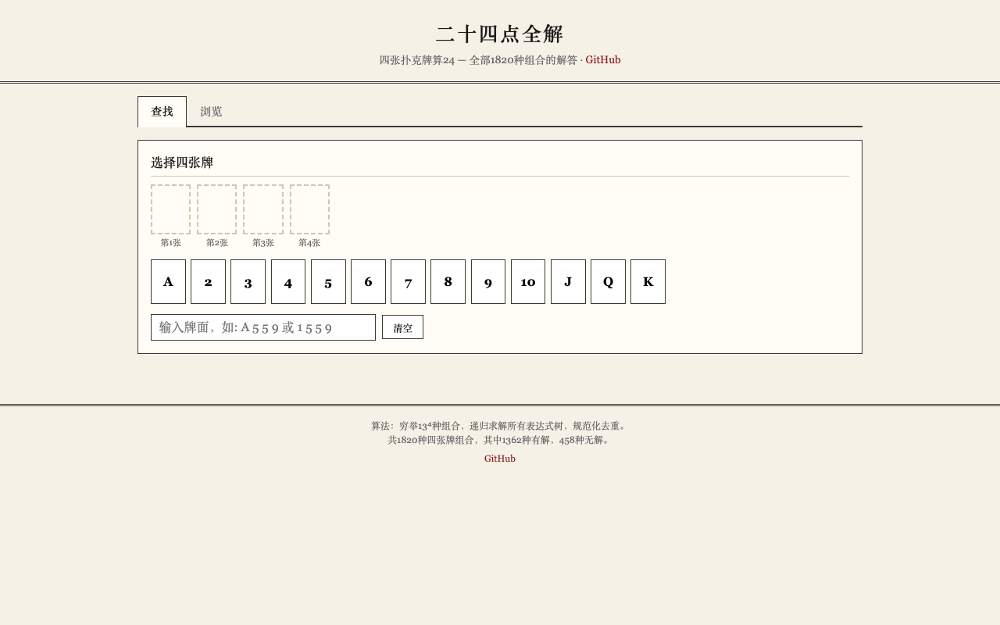 | 24 点游戏全部 1820 种四牌组合的解法库 | [Demo](https://holynova.github.io/24points/) · [Repo](https://github.com/holynova/24points) |
| 0 | Director Motorcycle Cinema | 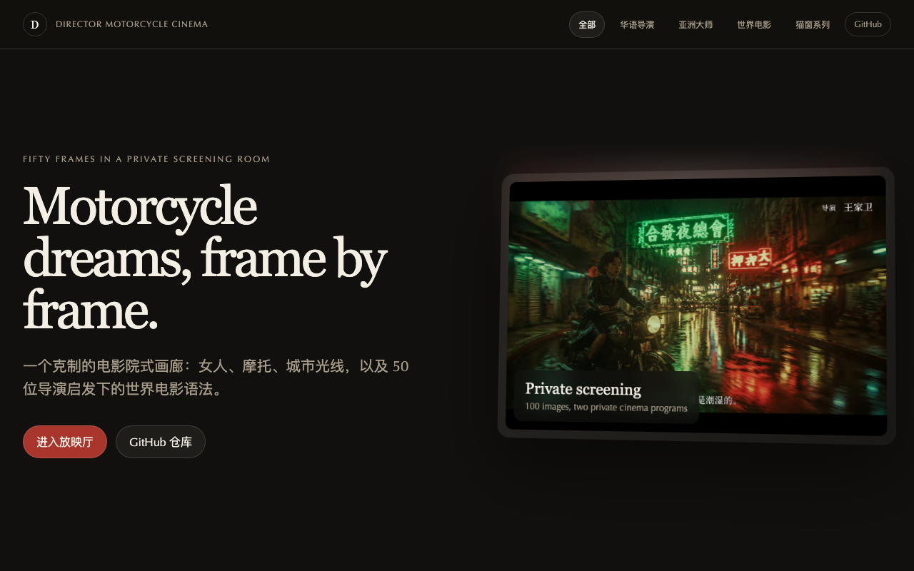 | 导演风格的摩托车与猫摄影电影感画廊 | [Demo](https://holynova.github.io/director-motorcycle-cinema/) · [Repo](https://github.com/holynova/director-motorcycle-cinema) |
| 0 | 3D 卡片景深实验室 | 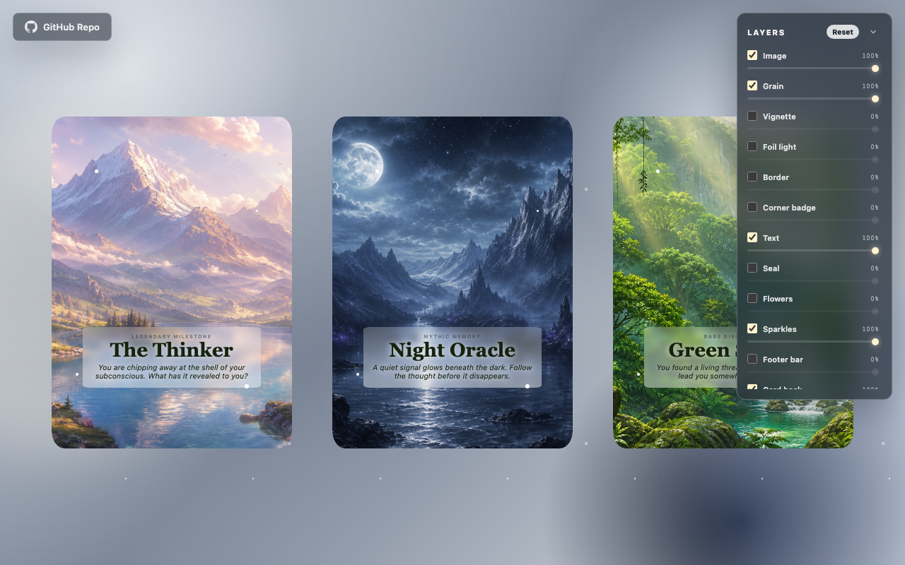 | 指针驱动的 CSS 3D 卡片、视差与景深效果 | [Demo](https://holynova.github.io/card-3d-depth-lab/) · [Repo](https://github.com/holynova/card-3d-depth-lab) |
| 0 | Ask All AI | 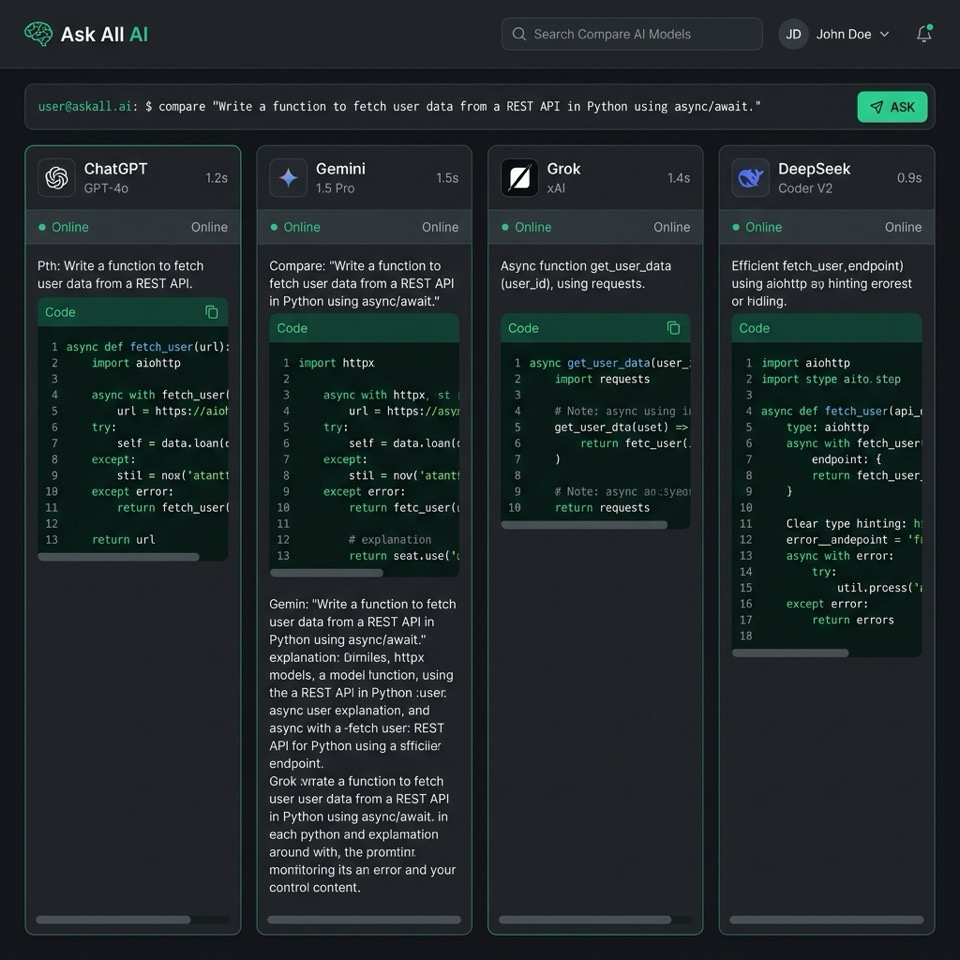 | 并排比较 ChatGPT、Gemini、Grok 和 DeepSeek 的流式回答 | [Demo](https://holynova.github.io/ask_all_ai/) · [Repo](https://github.com/holynova/ask_all_ai) |
| 0 | 文物打卡 | 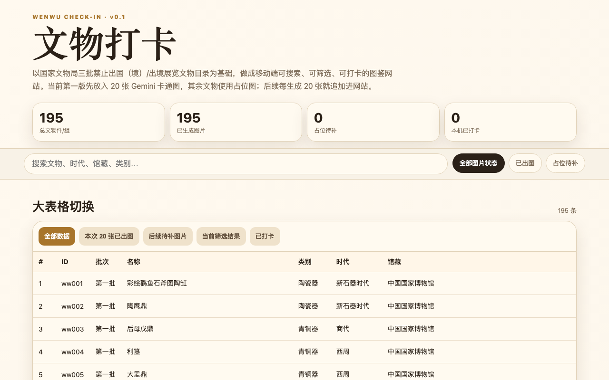 | 195 件禁止出境文物的检索、筛选与本地打卡 | [Demo](https://holynova.github.io/wenwu-checkin/) · [Repo](https://github.com/holynova/wenwu-checkin) |
| 0 | 小宇宙全集转录 | 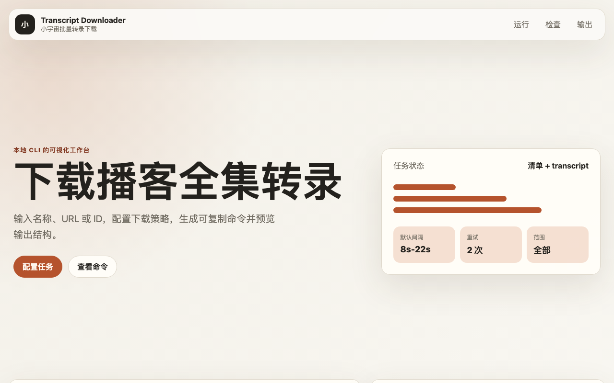 | 小宇宙播客列表与转录的批量下载工作台 | [Demo](https://holynova.github.io/xiaoyuzhou-transcript-downloader/) · [Repo](https://github.com/holynova/xiaoyuzhou-transcript-downloader) |
| 0 | Hand Fireworks |  | 用手势控制 Three.js 粒子文字与烟花效果 | [Demo](https://holynova.github.io/hand_fireworks/) · [Repo](https://github.com/holynova/hand_fireworks) |
| 0 | Cut & Remix | 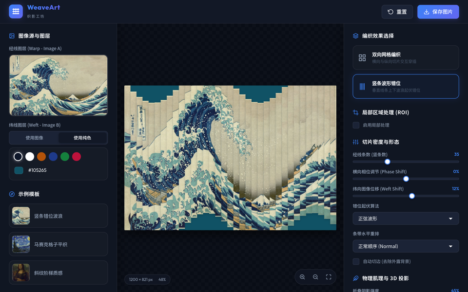 | 照片编织、图像解构与重组的生成艺术工具 | [Demo](https://holynova.github.io/cut_and_remix/) · [Repo](https://github.com/holynova/cut_and_remix) |
| 0 | WebGL 路径追踪 | 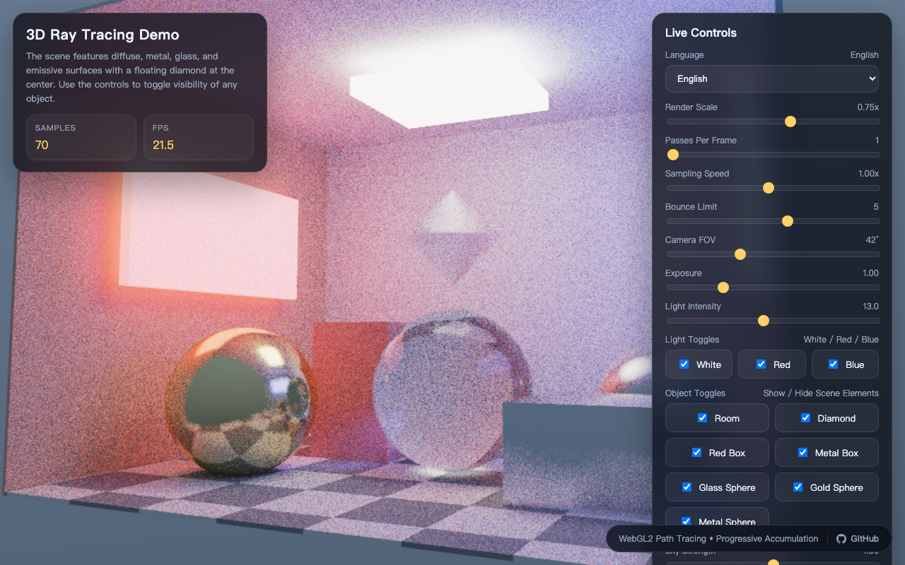 | 零依赖 WebGL2 实时路径追踪，展示漫反射、金属与玻璃材质 | [Demo](https://holynova.github.io/raytracing-demo/) · [Repo](https://github.com/holynova/raytracing-demo) |
| 0 | Emoji 人生时间线 | 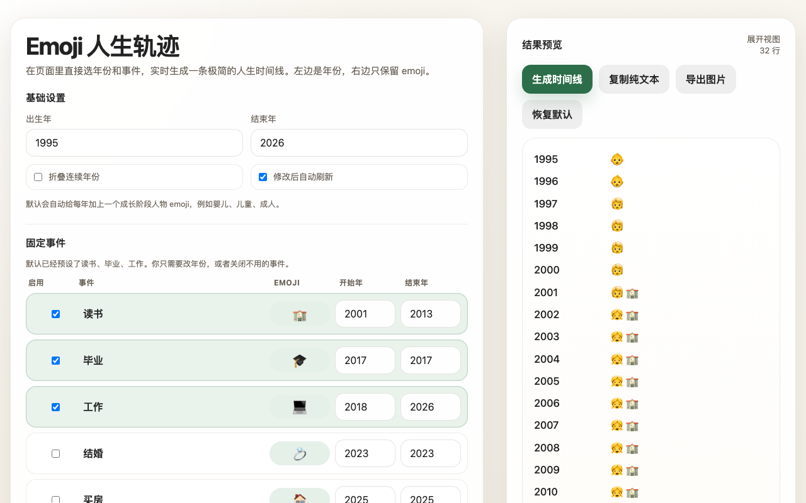 | 用 Emoji 事件编辑人生时间线并生成分享图 | [Demo](https://holynova.github.io/life_emoji/) · [Repo](https://github.com/holynova/life_emoji) |
| 0 | 鼠标滚轮健康检测 | 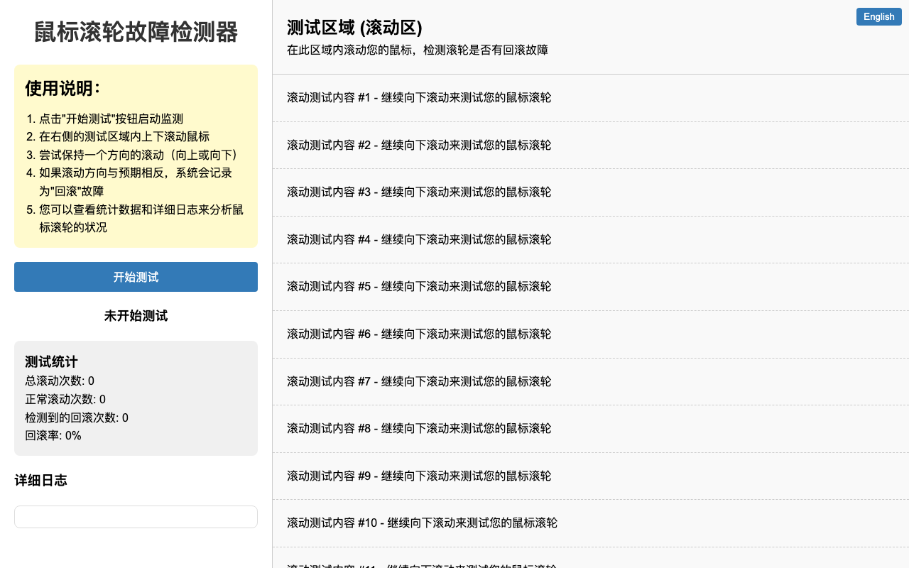 | 检测滚轮回滚、抖动与方向异常 | [Demo](https://holynova.github.io/mouse_scroll_heath_check/) · [Repo](https://github.com/holynova/mouse_scroll_heath_check) |
| 0 | PC Tools | 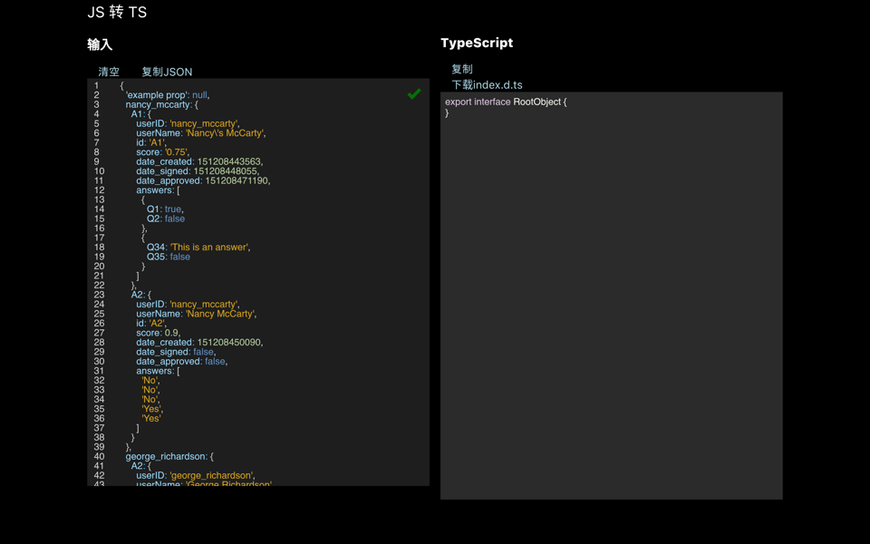 | JSON 转 TypeScript 与数据组合开发工具集 | [Demo](https://holynova.github.io/pc_tools/) · [Repo](https://github.com/holynova/pc_tools) |
| 0 | 协议转 HTML | 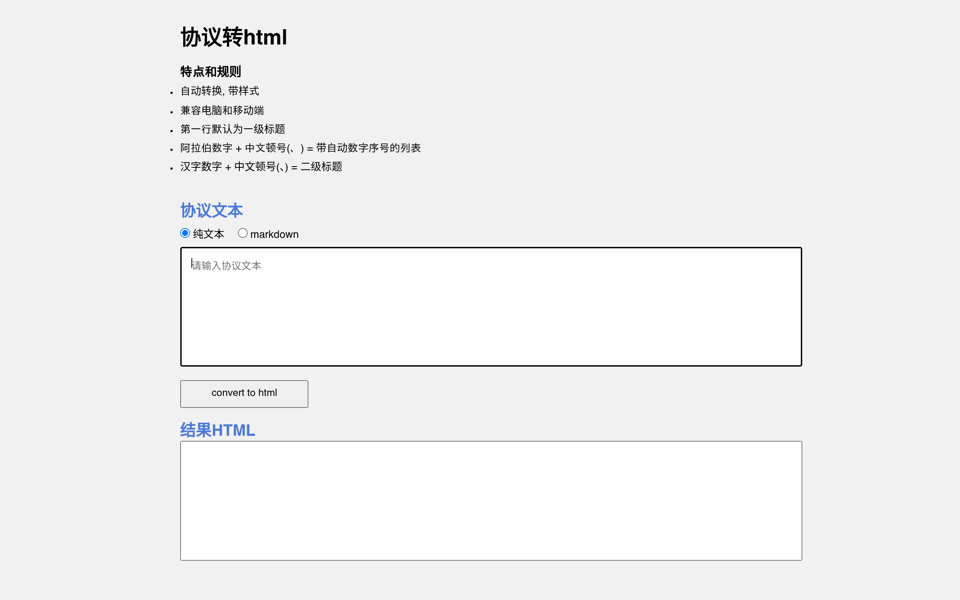 | 自动将协议和法律文档转换为 HTML | [Demo](https://holynova.github.io/agreement2html_web/) · [Repo](https://github.com/holynova/agreement2html_web) |
| 0 | Repo2Script |  | 浏览器内从可见的 GitHub 仓库页面导出文本文件，生成可恢复项目的 setup.sh | [Demo](https://holynova.github.io/one-punch/) · [Repo](https://github.com/holynova/one-punch) |
| 0 | Furniture Web |  | 响应式家具电商网站设计 | [Demo](https://holynova.github.io/furniture_web/) · [Repo](https://github.com/holynova/furniture_web) |
| 0 | 说人话的用药科普 | 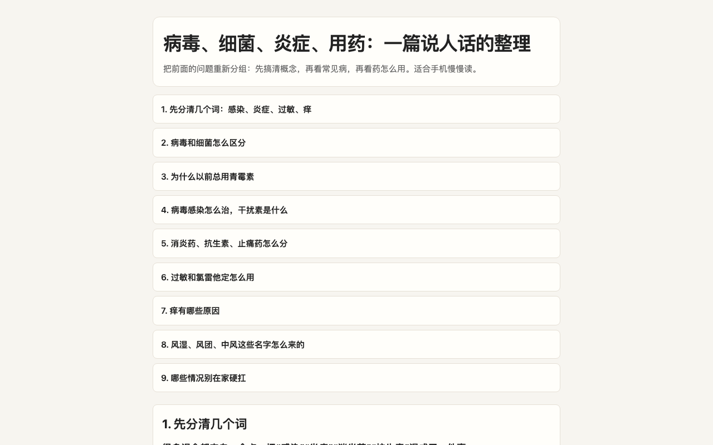 | 讲清病毒、细菌、炎症、抗生素与抗炎药的移动端科普 | [Demo](https://holynova.github.io/health-book/) · [Repo](https://github.com/holynova/health-book) |
| 0 | 评论区图书列表 |  | 从 2747 条评论整理 170 本书，支持搜索、学科筛选和排序 | [Demo](https://holynova.github.io/industry-book-recommender/) · [Repo](https://github.com/holynova/industry-book-recommender) |
| 0 | AI Agent 开发岗位面试报告 |  | 近 30 天岗位调研、能力要求与 102 道面试题整理 | [Demo](https://holynova.github.io/ai-agent-interview-report/) · [Repo](https://github.com/holynova/ai-agent-interview-report) |
| 0 | 德州扑克牌型概率 | 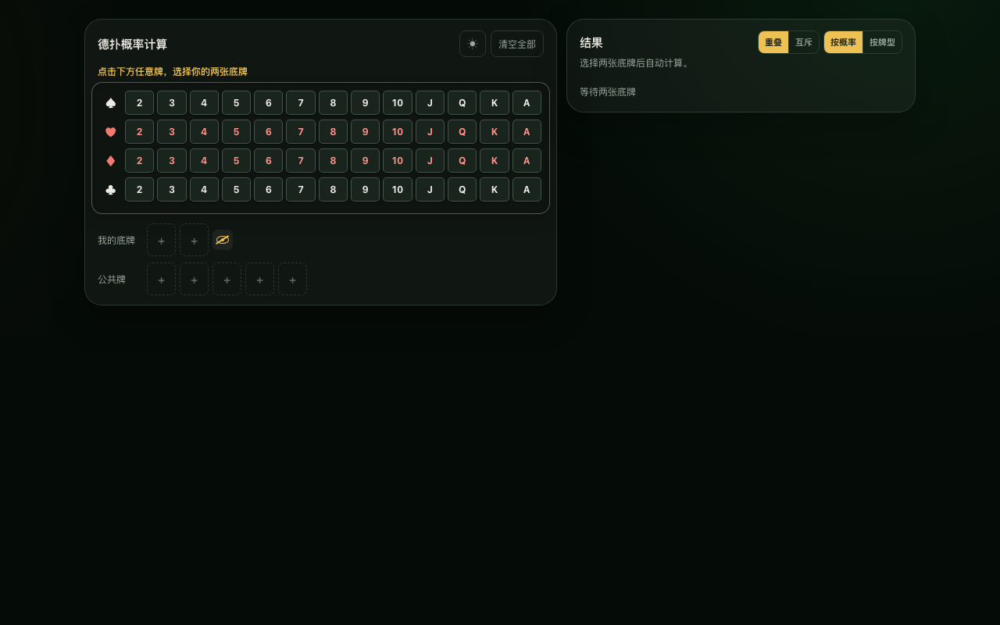 | 离线精确计算最终牌型与按牌型率的交互工具 | [Demo](https://holynova.github.io/texas-holdem-hand-probability/) · [Repo](https://github.com/holynova/texas-holdem-hand-probability) |
| 0 | 诗歌卡片 Tinder | 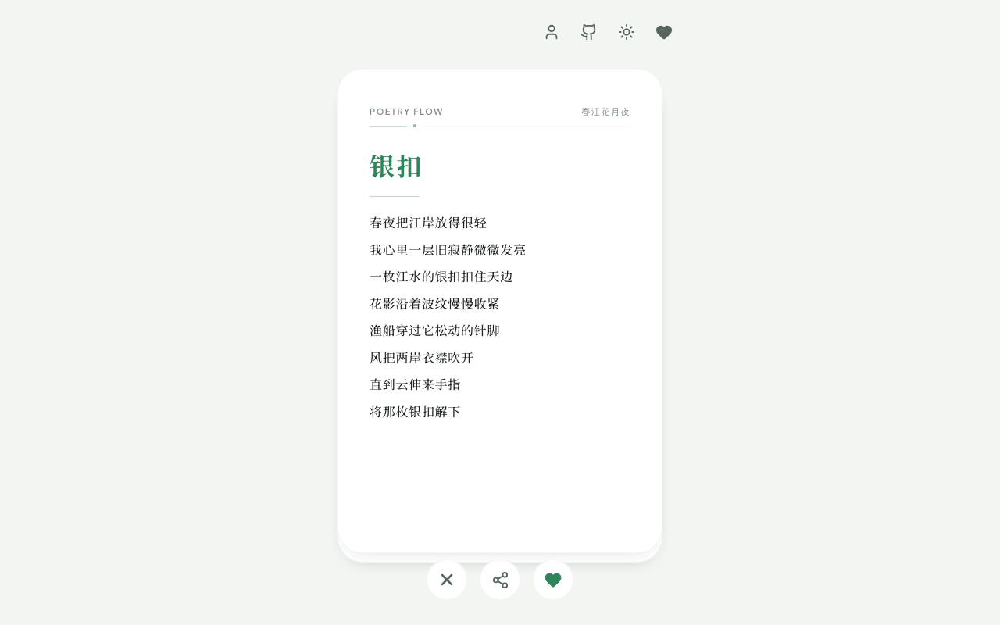 | Tinder 式现代诗歌浏览、双主题切换与高清海报导出 | [Demo](https://holynova.github.io/poetry-flow/) · [Repo](https://github.com/holynova/poetry-flow) |
| 0 | 50 Seeds |  | 48 类 × 50 条的 AI 作图视觉种子库，支持双语搜索、筛选、复制与 JSON 下载 | [Demo](https://holynova.github.io/50-seeds/) · [Repo](https://github.com/holynova/50-seeds) |
| 0 | Chrome Session TUI |  | macOS Chrome 自动化进程管理 TUI，识别并安全关闭遗留会话 | [Demo](https://holynova.github.io/chrome-session-tui/) · [Repo](https://github.com/holynova/chrome-session-tui) |
| 0 | Tiny Icons |  | Chrome 扩展和 Favicon 小图标生成器 | [Demo](https://holynova.github.io/tiny-icons/) · [Repo](https://github.com/holynova/tiny-icons) |
| 0 | Viewport Relay |  | 主屏同步多个 iPhone 视口的滚动、点击与导航 | [Demo](https://holynova.github.io/multi-screen-view/) · [Repo](https://github.com/holynova/multi-screen-view) |
| 0 | 古籍典籍谐音梗追踪器 |  | 基于 Sticker-Sheet Neo-Brutalism 视觉系统挖掘典籍谐音梗 | [Demo](https://holynova.github.io/xieyin/) · [Repo](https://github.com/holynova/xieyin) |
| 0 | Flash Words |  | 浏览器本地动态文字编排与视频、GIF 导出工具 | [Demo](https://holynova.github.io/flash-words/) · [Repo](https://github.com/holynova/flash-words) |
| 0 | 名从何来 |  | 品牌名称词源、读音与文化背景静态知识库 | [Demo](https://holynova.github.io/brand-etymology/) · [Repo](https://github.com/holynova/brand-etymology) |
| 0 | 近邻 | 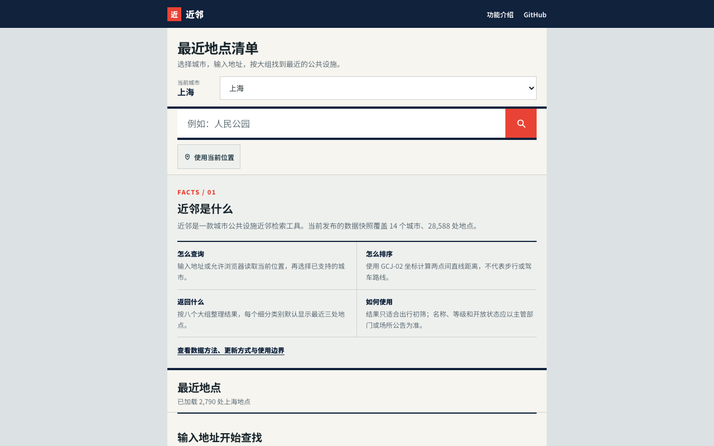 | 上海公共地点近邻检索，覆盖文化、交通、医疗、商业与社区服务 | [Demo](https://holynova.github.io/city-public-facilities/) · [Repo](https://github.com/holynova/city-public-facilities) |
| 0 | 诗歌公式 |  | 《意象的帝国》错配写诗方法论，含插图、例子与生成提示词 | [Demo](https://holynova.github.io/poem-formula/) · [Repo](https://github.com/holynova/poem-formula) |
| 0 | JSON Workbench | 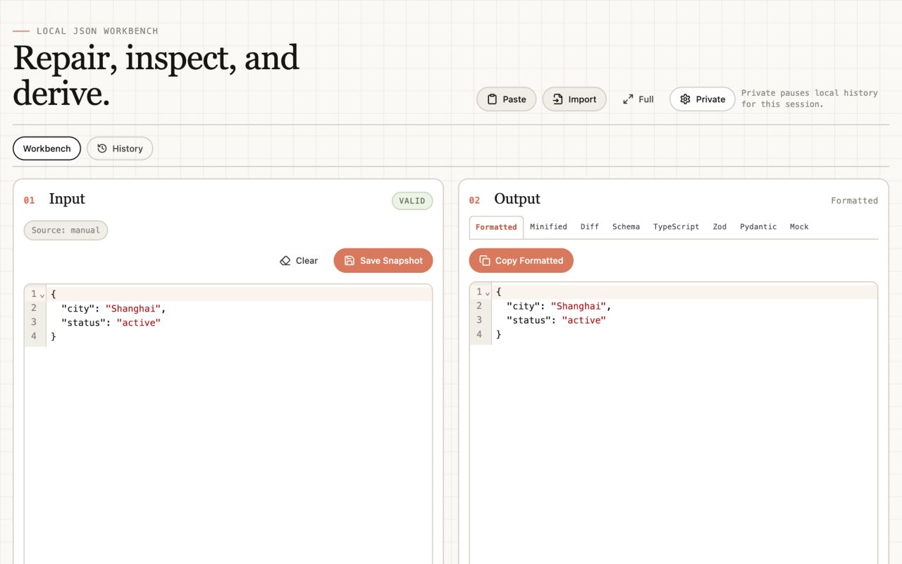 | 本地 JSON 修复、格式化、Schema/TS/Zod/Pydantic/Mock 生成 Chrome 插件 | [Demo](https://holynova.github.io/json-workbench-extension/) · [Repo](https://github.com/holynova/json-workbench-extension) |
| 0 | Game Tier | 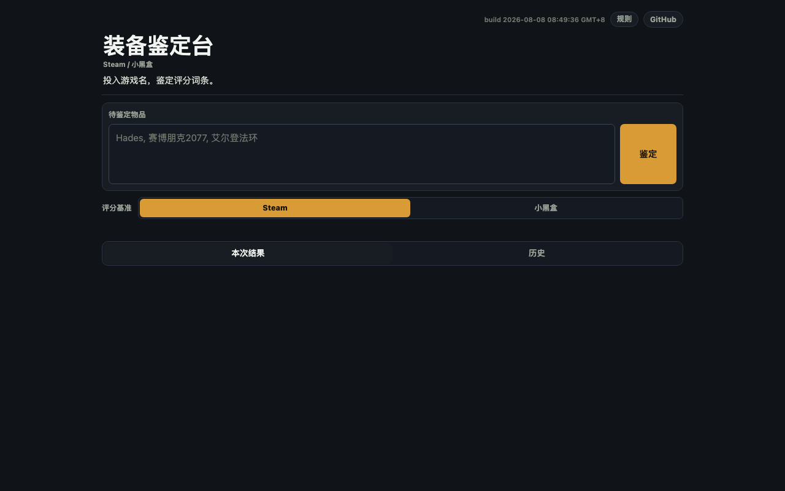 | Steam / 小黑盒游戏评分查询 CLI + 网页应用 | [Demo](https://holynova.github.io/game-rating-lookup/) · [Repo](https://github.com/holynova/game-rating-lookup) |
| 0 | 移动端传感器面板 | 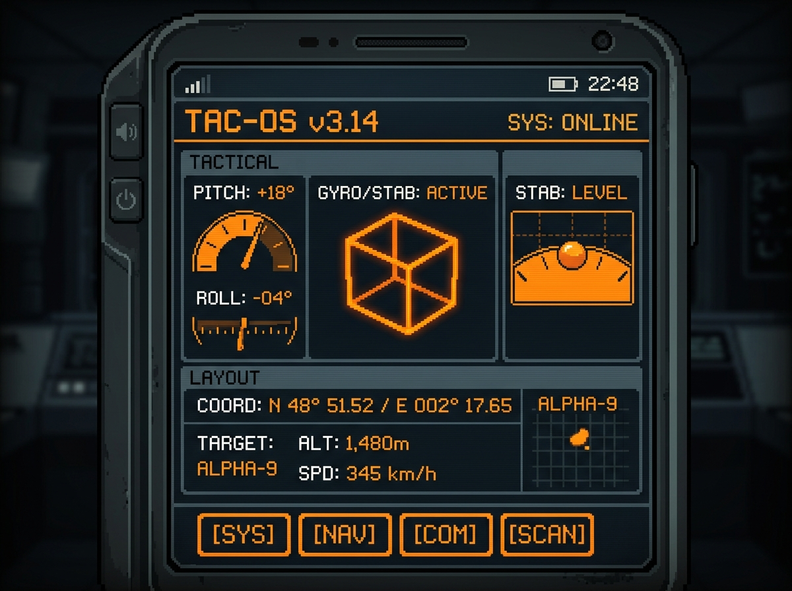 | 3D WebGL 移动端陀螺仪与加速度计交互面板 | [Demo](https://holynova.github.io/mobile-sensor-playground/) · [Repo](https://github.com/holynova/mobile-sensor-playground) |
| 0 | 地图投影形变实验室 | 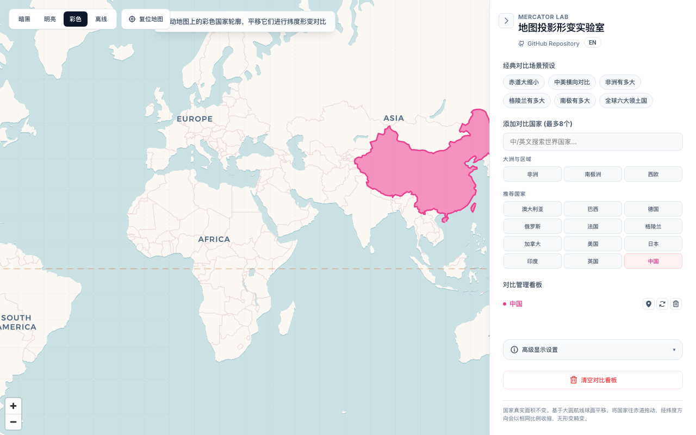 | 在 Web Mercator 投影下对比国家真实大小。支持大圆球面平移、中英双语切换、经纬网及赤道参考线，内置经典场景预设 | [Demo](https://holynova.github.io/mercator-country-compare/) · [Repo](https://github.com/holynova/mercator-country-compare) |
| 0 | JS vs Go 对比学习 | 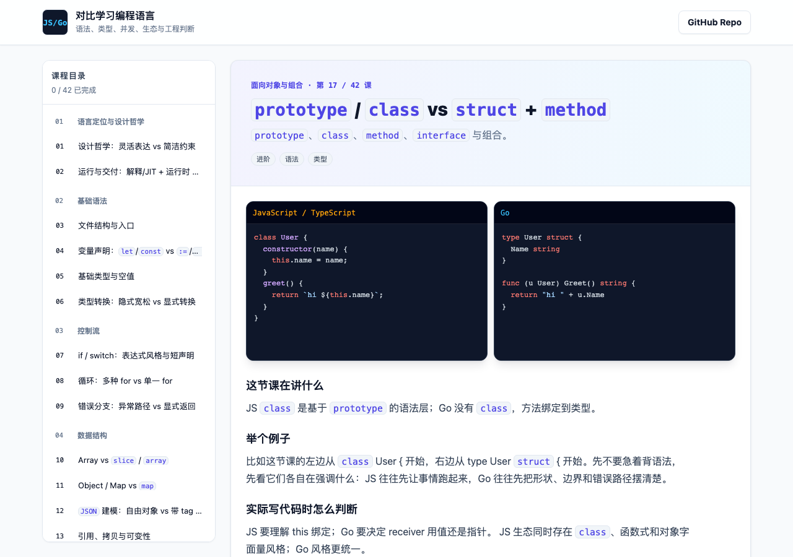 | 单页课程网站，对比 JavaScript 与 Go | [Demo](https://holynova.github.io/js-go-compare/) · [Repo](https://github.com/holynova/js-go-compare) |
| 0 | GitHub Pages Detector |  | GitHub repo Pages 状态检测插件 | [Demo](https://holynova.github.io/github-pages-detector-extension/) · [Repo](https://github.com/holynova/github-pages-detector-extension) |
| 0 | 收藏夹淘金 | 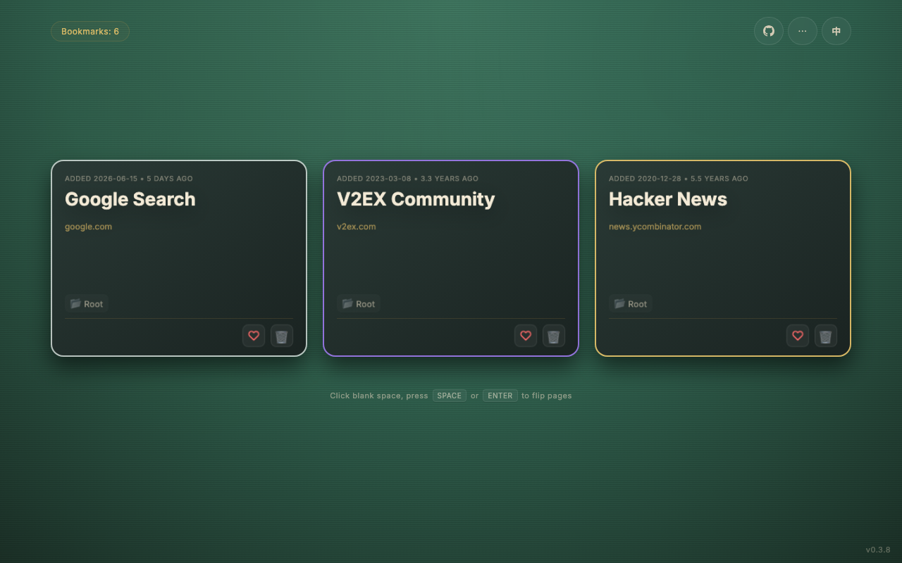 | 新标签页随机展示收藏夹 | [Repo](https://github.com/holynova/collection_miner) |
| 0 | 韵脚画布 | 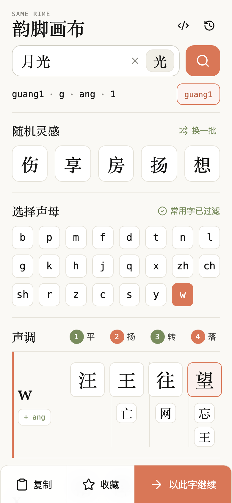 | 移动端中文押韵字查找 | [Demo](https://holynova.github.io/char_finder/) · [Repo](https://github.com/holynova/char_finder) |
| 0 | 网页动效设计灵感库 |  | 30 个经典网页动画 + AI 提示词 | [Demo](https://holynova.github.io/web-motion-showcase/) · [Repo](https://github.com/holynova/web-motion-showcase) |
| 0 | AI Updater Skill | 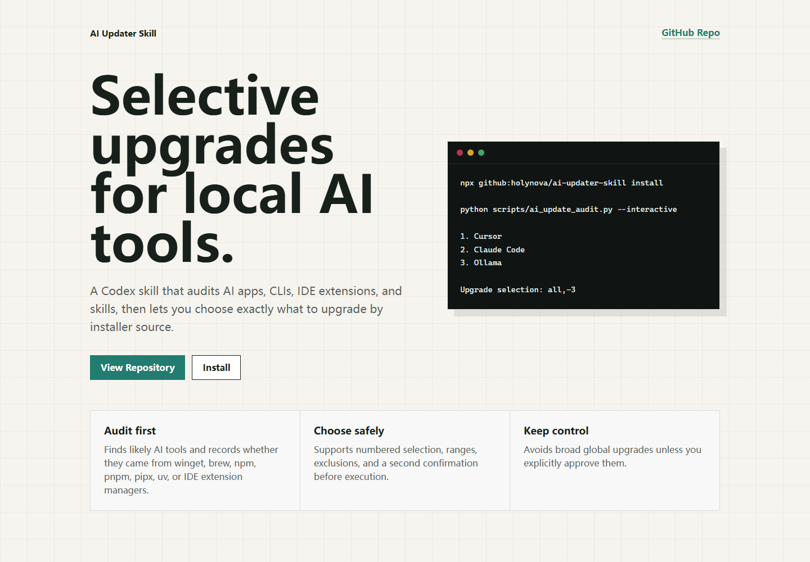 | 审计 AI apps 并安全升级 | [Demo](https://holynova.github.io/ai-updater-skill/) · [Repo](https://github.com/holynova/ai-updater-skill) |
| 0 | 设计系统目录库 | 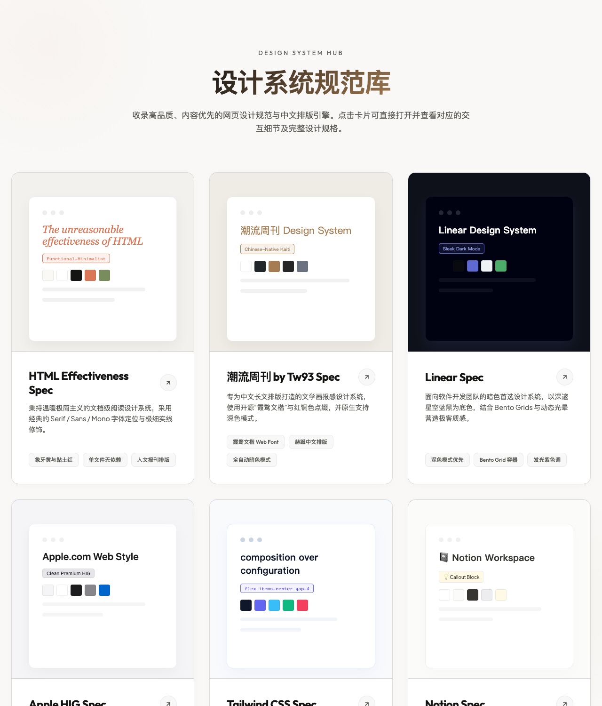 | 网页设计规范 + 低饱和配色 | [Demo](https://holynova.github.io/my-design-system/) · [Repo](https://github.com/holynova/my-design-system) |
| 1 | 电子万花尺 | 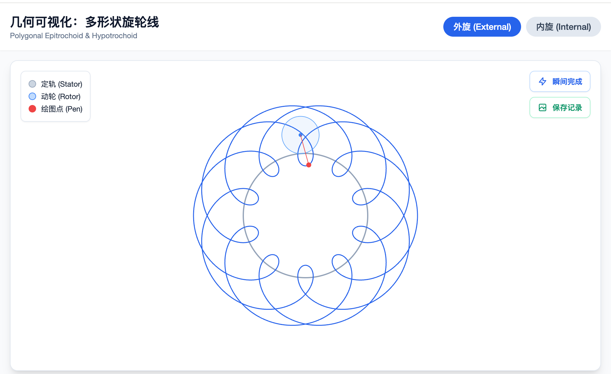 | 旋轮线可视化，多形状配色 | [Demo](https://holynova.github.io/spinning-drawer/) · [Repo](https://github.com/holynova/spinning-drawer) |
| 0 | 人像时间线 |  | 人脸照片对齐 + MP4/GIF 导出 | [Demo](https://holynova.github.io/photo_align/) · [Repo](https://github.com/holynova/photo_align) |
| 0 | Z-Image-Turbo Local Studio | 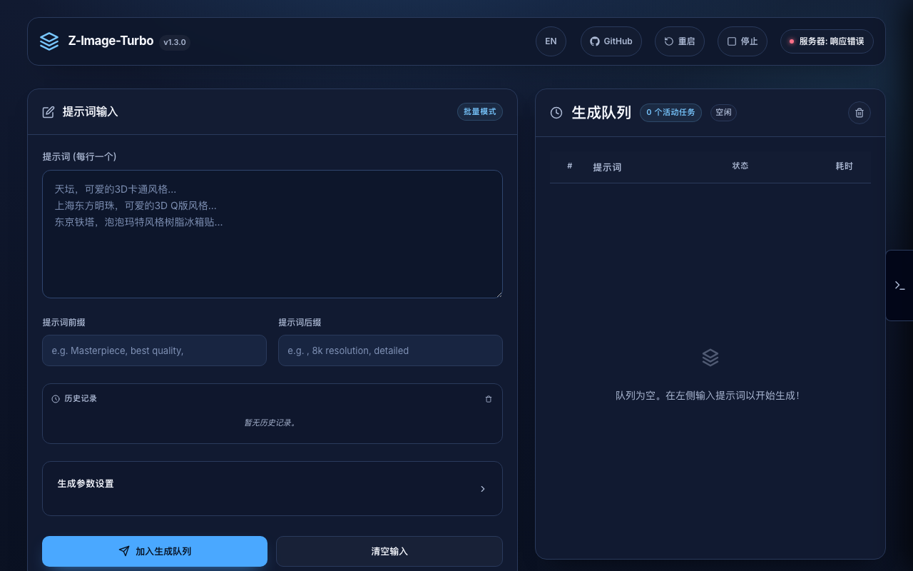 | 本地 AI 生图工作台 | [Demo](https://holynova.github.io/image_local_llm/) · [Repo](https://github.com/holynova/image_local_llm) |
| 0 | 书香管家 |  | AI 拍照识别 + 3D 虚拟书架 | [Demo](https://holynova.github.io/bookshelf_manager/) · [Repo](https://github.com/holynova/bookshelf_manager) |
| 0 | 视频提示词生成器 | 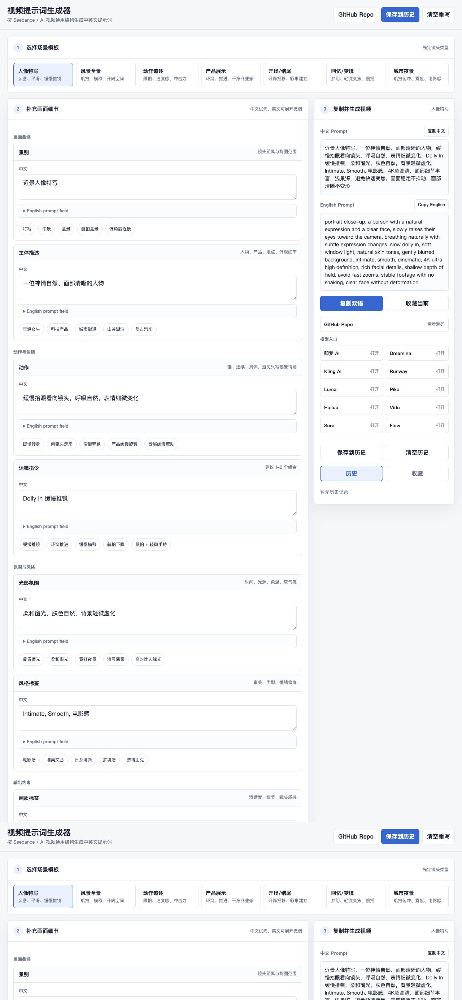 | 中英文 AI 视频 Prompt 模板 | [Demo](https://holynova.github.io/video_prompt_generator/) · [Repo](https://github.com/holynova/video_prompt_generator) |
| 0 | Offer 比较神器 |  | 薪资对比 + 多维评分图表 | [Demo](https://holynova.github.io/offer_compare/) · [Repo](https://github.com/holynova/offer_compare) |
| 0 | Scrape to Markdown |  | 网页转 Markdown + 图片批量打包 | [Repo](https://github.com/holynova/scrape-to-markdown.chrome) |
| 0 | iOS打字模拟 |  | iOS 键盘自适应消隐模拟 | [Demo](https://holynova.github.io/keyboard_sentence/) · [Repo](https://github.com/holynova/keyboard_sentence) |
| 6 | Gemini 批量生图插件 |  | 提示词逐条发送 + 进度条 | [Repo](https://github.com/holynova/prompt_one_by_one) |
| 0 | 坦克战术 | 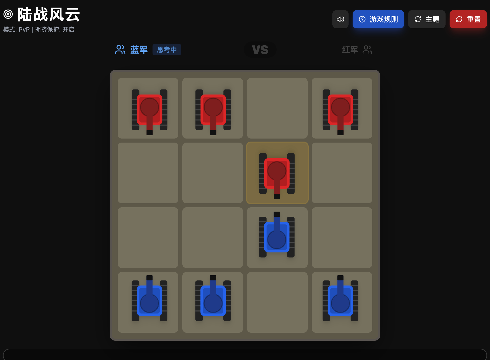 | 坦克二打一，支持 PvP/PvE | [Demo](https://holynova.github.io/tank-tactics-game/) · [Repo](https://github.com/holynova/tank-tactics-game) |
| 0 | 俳句Tinder | 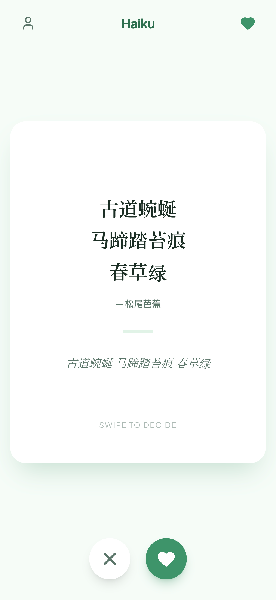 | 滑动浏览经典俳句 | [Demo](https://holynova.github.io/haiku-flow) · [Repo](https://github.com/holynova/haiku-flow) |
| 0 | 一眼看电影 | 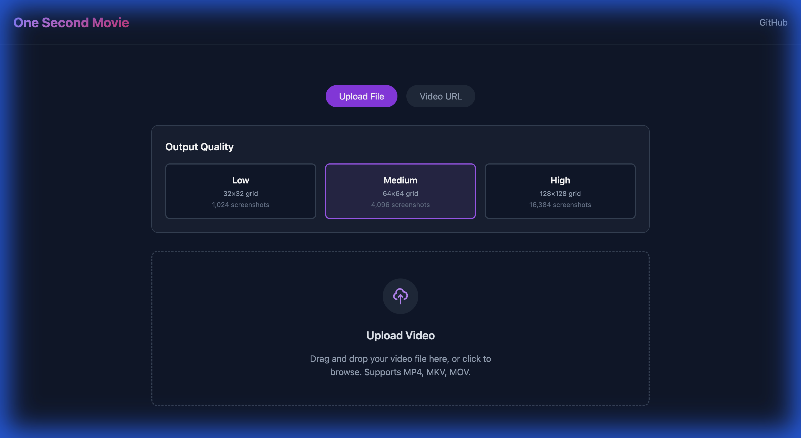 | 视频压缩为 4K 联系表 | [Demo](https://holynova.github.io/one_second_movie/) · [Repo](https://github.com/holynova/one_second_movie) |
| 1 | JSON转TypeScript定义 |  | JS 自动推导 TS 类型 | [Demo](https://holynova.github.io/json_to_ts/) · [Repo](https://github.com/holynova/json_to_ts) |
| 0 | 生命时间轴可视化 | - | 甘特图展示生命时间线 | [Repo](https://github.com/holynova/life_bar_chart) |
| 1 | 等宽文字生成器 |  | 自动调整字号使视觉等宽 | [Demo](https://holynova.github.io/equal_width/) · [Repo](https://github.com/holynova/equal_width) |
| 0 | 弹幕附魔 |  | 文字转同音化学元素 | [Demo](https://holynova.github.io/string_alchemy/) · [Repo](https://github.com/holynova/string_alchemy) |
| 4 | 藏头诗生成器 |  | 藏头诗藏尾诗生成 | [Demo](https://holynova.github.io/head_tail_poem/) · [Repo](https://github.com/holynova/head_tail_poem) |
| 0 | 排序算法可视化 |  | 排序算法可视化 playground | [Demo](https://holynova.github.io/algorithm/show_sort/index.html) · [Repo](https://github.com/holynova/algorithm) |
| 1 | 倒推工资 | 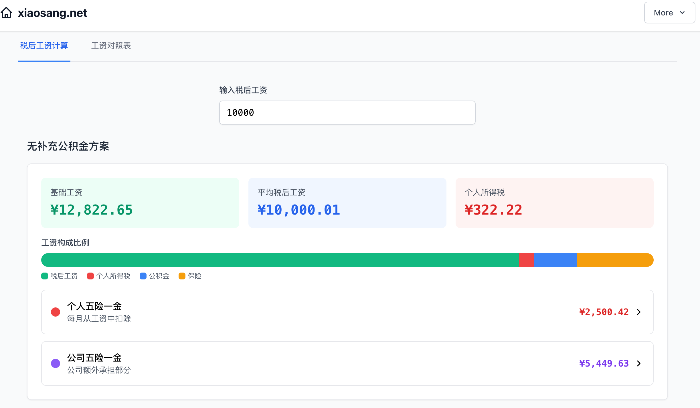 | 税后工资计算器 | [Demo](https://holynova.github.io/salary) · [Repo](https://github.com/holynova/json_to_ts) |
| 1 | 排列组合生成器 | 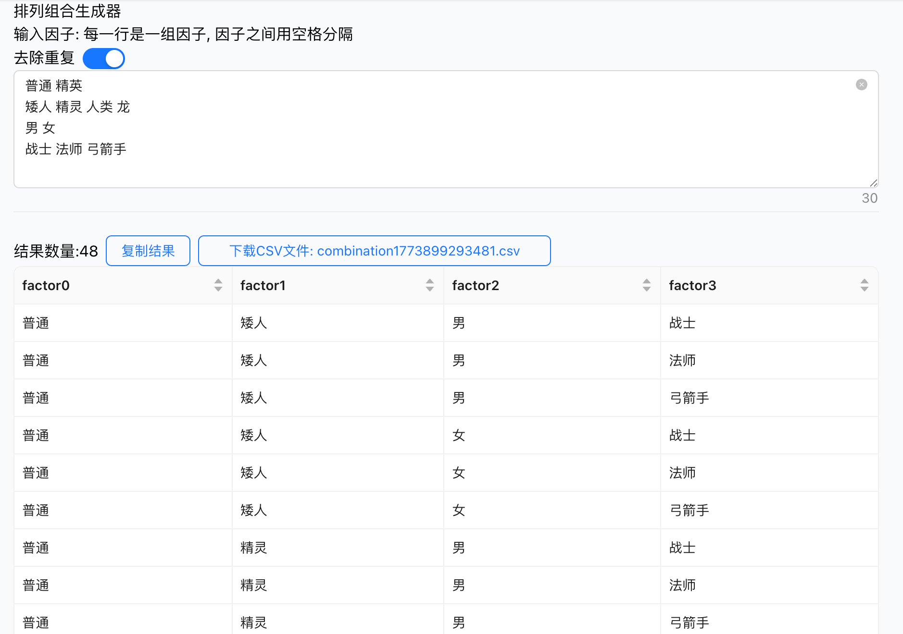 | 排列组合计算 + 可视化 | [Demo](https://holynova.github.io/combination) · [Repo](https://github.com/holynova/json_to_ts) |
| 1 | 节假日可视化 | 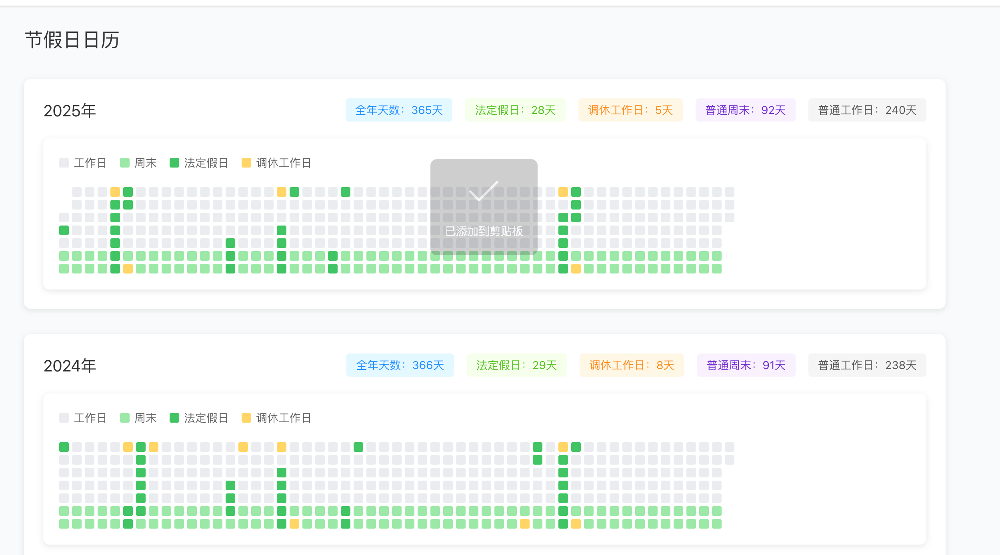 | 年度节假日日历 + 贡献图 | [Repo](https://github.com/holynova/json_to_ts) |
| 1 | 火锅定时器 | 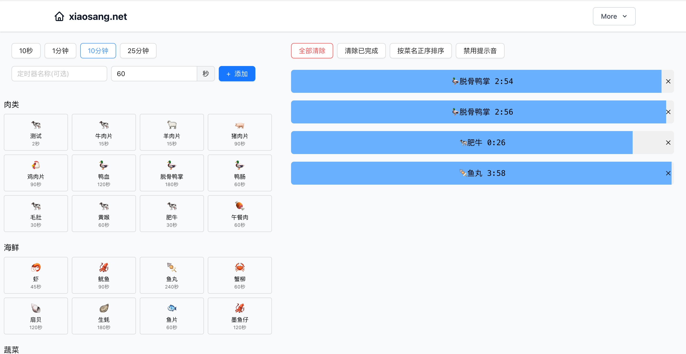 | 多食材同时计时 | [Repo](https://github.com/holynova/json_to_ts) |
| 0 | YouTube视频抓取 |  | YouTube 视频内容抓取 | - |
| 0 | 100 Clocks | 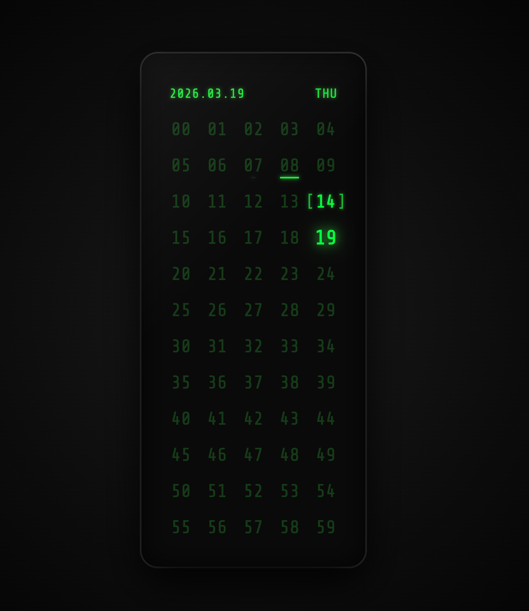 | 不同风格的时钟集合 | [Demo](https://holynova.github.io/100-clocks) · [Repo](https://github.com/holynova/100-clocks) |

# 语言统计

